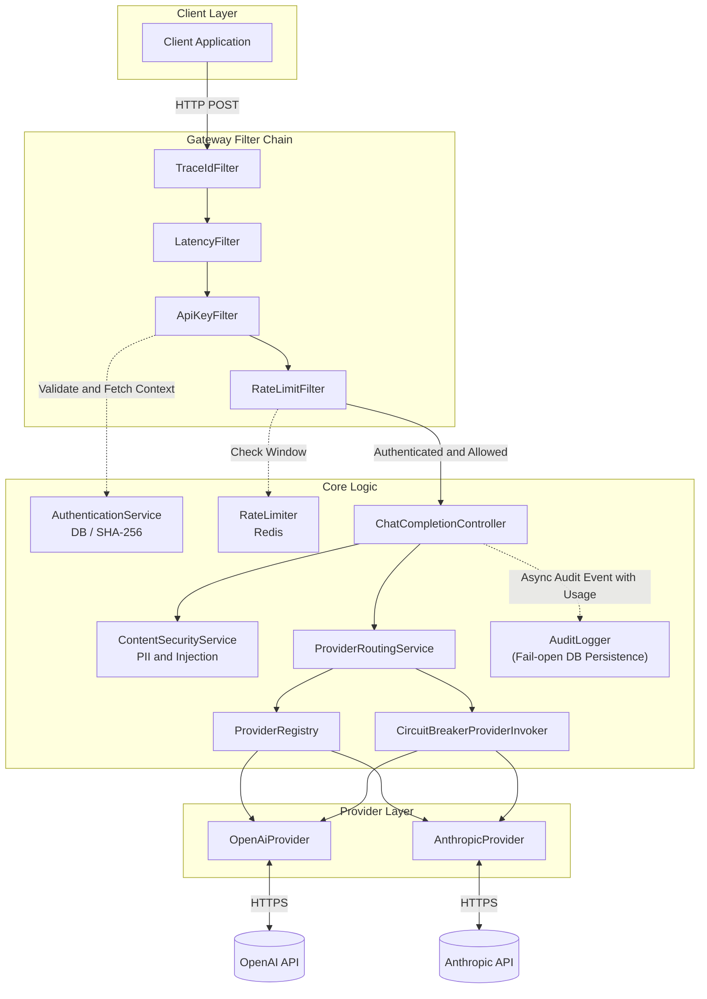

# Policy-Aware Multi-LLM Gateway

LLM / Agent 呼び出しを本番運用するための **運用統治レイヤー（Gateway）**。
アプリケーションと LLM プロバイダの間に配置し、認証、プロバイダ抽象化、レート制御、可用性、安全性、監査性を一元的に扱う。

> **ポートフォリオ第 3 弾** — 第 1 弾 [Retrieval品質管理システム](静的品質保証） / 第 2 弾 [Agentic Control Plane]（動的制御） に続く運用統治レイヤー。

---
## Why

LLM/Agent を本番で運用する際、コスト暴走・プロバイダ障害・PII 流出・監査要件
への対応が必要になる。本プロジェクトは、これらを横断的に統治する Gateway 層を、
Spring Boot / Flyway / Redis / structured logging を土台に段階的に実装する設計探索である。
単に AI を呼び出せるだけでなく、安全に使え、障害時に劣化運転でき、後から追跡できることを重視している。

---


## Architecture



**Response Headers** — 全レスポンスに Gateway 拡張ヘッダが付与されます:

| Header | Description |
|:---|:---|
| `X-Gateway-Trace-Id` | リクエスト固有の UUID（MDC でログに連携） |
| `X-Gateway-Latency-Ms` | Gateway 内の処理時間 (ms) |
| `X-Gateway-Requested-Provider` | リクエストで要求された provider 名 |
| `X-Gateway-Provider` | **実解決値** (ルーティング後に実際に使用されたプロバイダ名) |
| `X-Gateway-Fallback-Used` | fallback routing が実行されたか (`true` / `false`) |
| `X-RateLimit-Limit` | テナントごとの 1 分間あたりのリクエスト上限 |
| `X-RateLimit-Remaining` | 現在の 1 分間における残りリクエスト可能数 |
| `X-Gateway-Security-Blocked` | セキュリティポリシー違反によりブロックされた場合 (`true`) |
| `X-Gateway-Block-Reason` | ブロック理由 (`PII_DETECTED`, `INJECTION_DETECTED`) |

---

## Design Decisions

| 判断 | 選定 | Why |
|:---|:---|:---|
| Web 層 | Spring MVC + Virtual Threads | リアクティブの複雑性回避、JPA/Redis 親和性 |
| API I/F | OpenAI 互換 | 既存 SDK 流用、ロックイン回避 |
| Provider 抽象化 | Interface + Mapper | LLM プロバイダ追加を低コスト化 |
| 認証方式 (Sprint 2) | DB (SHA-256) | deterministic hash による lookup simplicity を優先。stronger secret rotation / vault integration は future work。 |
| レートリミット (Sprint 2) | Redis Fixed-Window | Fail-open 設計 (Redis 障害時でもリクエストをブロックしない)。Retry-After は現状 60 秒固定 (将来 window 残り時間へ改善可能)。 |
| 可用性戦略 (Sprint 3) | controlled degradation | timeout / 5xx / breaker-open 時に single-step fallback を許可し、provider 4xx や invalid response は隠蔽しすぎない。 |
| セキュリティ監査 (Sprint 4) | ContentSecurityService + Async AuditDB | PIIマスキングやインジェクション検知をルーティング前に実施。監査ログ保存はDBダウン時にもメインフローを止めない Fail-open 設計。テナントごとのポリシー(BLOCK, MASK, WARN)を動的に適用。 |
| ビルドツール | Gradle (Groovy DSL) | Spring Boot 標準、CI キャッシュ親和性 |
---


## Tech Stack

| Component | Technology |
|:---|:---|
| Language | Java 21 (Virtual Threads) |
| Framework | Spring Boot 3.5.14 |
| Web | Spring MVC + Virtual Threads |
| HTTP Client | RestClient |
| Database | PostgreSQL 16 + Flyway |
| Cache | Redis 7 |
| Logging | Logback + logstash-logback-encoder (structured JSON) |
| Resilience | Resilience4j (Circuit Breaker) |
| Build | Gradle 8.14 |
| Container | Docker Compose |
| CI | GitHub Actions |

---

## Quick Start

### Prerequisites

- Java 21
- Docker & Docker Compose

### 1. Setup

```bash
git clone https://github.com/mlprototype/policy-aware-llm-gateway.git
cd policy-aware-llm-gateway

cp .env.example .env
```

`.env` を編集して API Key を設定:

```dotenv
# === Gateway Authentication ===
# DB投入済みの Dev API Key を使用 (V2_1__seed_dev_tenant.sql 参照)
GATEWAY_API_KEY=dev-gateway-key-001

# === LLM Provider ===
OPENAI_API_KEY=sk-proj-xxxxxxxxxxxxx        # OpenAI API Key
ANTHROPIC_API_KEY=sk-ant-xxxxxxxxxxxxxxxx   # Anthropic API Key
```

### 2. Run with Docker Compose

```bash
docker compose up --build -d
```

- `app` (Gateway 本体) — port 8080
- `postgres` (PostgreSQL 16) — port 5433
- `redis` (Redis 7) — port 6379

### 3. Smoke Test

```bash
# ✅ OpenAI Proxy — 正常リクエスト
source .env
curl -s http://localhost:8080/v1/chat/completions \
  -H "Content-Type: application/json" \
  -H "X-API-Key: $GATEWAY_API_KEY" \
  -d '{
    "messages": [{"role": "user", "content": "Say hello in one word"}],
    "max_tokens": 10
  }' | jq .

# → {"id":"chatcmpl-...","model":"gpt-4o-mini-2024-07-18",
#    "choices":[{"message":{"content":"Hello!"}}]}

# ❌ Auth Failure — API Key なし
curl -s http://localhost:8080/v1/chat/completions \
  -H "Content-Type: application/json" \
  -d '{"messages": [{"role": "user", "content": "Hello"}]}' | jq .

# → {"status":401,"error":"Unauthorized","message":"Invalid or missing API key",
#    "trace_id":"..."}

# 💚 Health Check — 認証不要
curl -s http://localhost:8080/actuator/health | jq .

# → {"status":"UP"}
```

### 4. Observability Dashboard

Sprint 5 より、Prometheus と Grafana を使った可視化が追加されました。

1. `docker compose up -d` 実行後、数十秒〜1分程度待機します（Prometheus がメトリクスを収集し、Grafana がダッシュボードをプロビジョニングするため）。
2. ブラウザで Grafana (`http://localhost:3000`) にアクセスします。
   - ログインは不要です（ローカルデモ用途の簡易設定として匿名アクセスが有効化されています。本番環境での推奨設定ではありません）。
3. **LLM Gateway Overview** ダッシュボードが自動的にロードされ、以下の情報が視覚的に確認できます。
   - Gateway Total Requests (RPS)
   - Provider Error Rate & HTTP Request Latency
   - Rate Limit Rejects & Security Blocks / Warns

### Run Locally (without Docker)

PostgreSQL and Redis must be running locally before starting the application.

```bash
SPRING_PROFILES_ACTIVE=local ./gradlew bootRun
```

---

## API Reference

### `POST /v1/chat/completions`

OpenAI Chat Completions API 互換エンドポイント。

**Headers:**

| Header | Required | Description |
|:---|:---|:---|
| `X-API-Key` | ✅ | Gateway 認証キー (DBのテナントと紐付け) |
| `X-Gateway-Requested-Provider` | ❌ | 使用プロバイダの**要求値** (`openai` または `anthropic` / default: `openai`) |
| `X-Gateway-Provider` | ❌ | request では legacy alias。response では**実解決値**を返す |
| `X-Request-Id` | ❌ | クライアント指定のトレース ID |

**Request Body:**

```json
{
  "model": "gpt-4o-mini",
  "messages": [
    {"role": "system", "content": "You are helpful."},
    {"role": "user", "content": "Hello!"}
  ],
  "temperature": 0.7,
  "max_tokens": 1024
}
```

**Cost Safety:** `max_tokens` は Gateway 側で上限 4096 にクランプされます。

**Migration Note:** request header は `X-Gateway-Requested-Provider` が正です。`X-Gateway-Provider` を request で送る形式は後方互換のため一時的に許可しています。両方送信して値が不一致の場合は `400 Bad Request` を返します。

### HTTP Semantics

- `400 Bad Request`: invalid request format, OR security policy violation (PII/Injection blocked)
- `401 Unauthorized`: missing or invalid API key
- `403 Forbidden`: authenticated, but tenant is suspended
- `429 Too Many Requests`: tenant rate limit exceeded
- `502 Bad Gateway`: upstream provider 4xx / 5xx / invalid response
- `503 Service Unavailable`: timeout / connection error / circuit breaker open

### Security & Policies

テナントごとにセキュリティポリシー（PII アクション・インジェクションアクション）を制御可能です。

- **`ALLOW`**: 何もせず通過。
- **`WARN`**: リクエストは通過するが、監査ログに検知フラグを立てて記録。
- **`MASK`**: (PII専用) リクエスト本文の該当文字列を `[EMAIL_REDACTED]` などにマスクして Provider へ送信。
- **`BLOCK`**: 400 Bad Request で遮断。アップストリームへは送信しない。

> **Note:** PII BLOCK の優先順位は最上位となります。同一リクエスト内で PII とインジェクションが検知された場合、PII のアクションが BLOCK であれば即時エラーとなります。

### Degraded Mode

- fallback は 1 段のみです。`openai -> anthropic`、`anthropic -> openai`
- fallback 対象は `timeout`, `connection error`, `upstream 5xx`, `breaker-open`
- provider 4xx は fallback しません
- `INVALID_RESPONSE` は upstream schema drift と mapper 不整合の両方を含み得るため、Sprint 3 では安全側で fallback 対象外にしています

---

## Project Structure

```text
src/main/java/io/github/mlprototype/gateway/
├── api/              # REST Controllers
├── audit/            # Structured audit logging
├── config/           # RestClient, Jackson configuration
├── dto/              # Request / Response DTOs
├── exception/        # Global exception handler
├── filter/           # Servlet filters (TraceId, Latency, ApiKey, RateLimit)
├── content/          # (Sprint 4) Security & Content filtering (PII / Injection)
├── provider/         # LLM Provider abstraction
│   ├── openai/       # OpenAI implementation
│   └── anthropic/    # Anthropic implementation
├── ratelimit/        # Redis-based fixed-window rate limiting
├── router/           # Provider routing logic
└── security/         # Tenant / API client authentication
```

---

## Configuration

主要な設定値 (`application.yml`):

| Property | Default | Description |
|:---|:---|:---|
| `gateway.provider.openai.api-key` | env `OPENAI_API_KEY` | OpenAI API Key |
| `gateway.provider.openai.default-model` | `gpt-4o-mini` | OpenAI デフォルトモデル |
| `gateway.provider.anthropic.api-key` | env `ANTHROPIC_API_KEY` | Anthropic API Key |
| `gateway.provider.anthropic.default-model` | `claude-3-haiku-20240307` | Anthropic デフォルトモデル |
| `spring.data.redis.host` | `localhost` / `redis` | Redis host |
| `spring.data.redis.port` | `6379` | Redis port |
| `spring.threads.virtual.enabled` | `true` | Virtual Threads 有効化 |

---

## Testing

```bash
# Unit + Integration tests (mock-based, no API call)
./gradlew test

# Local smoke test (Docker health / basic request)
docker compose up -d
source .env

# 1. OpenAI (Default)
curl -s http://localhost:8080/v1/chat/completions \
  -H "Content-Type: application/json" \
  -H "X-API-Key: $GATEWAY_API_KEY" \
  -d '{"messages":[{"role":"user","content":"ping"}],"max_tokens":5}'

# 2. Anthropic
curl -s http://localhost:8080/v1/chat/completions \
  -H "Content-Type: application/json" \
  -H "X-API-Key: $GATEWAY_API_KEY" \
  -H "X-Gateway-Requested-Provider: anthropic" \
  -d '{"messages":[{"role":"user","content":"What is 2+2? Keep it short."}],"max_tokens":10}'

# 3. Suspended tenant (403)
curl -s http://localhost:8080/v1/chat/completions \
  -H "Content-Type: application/json" \
  -H "X-API-Key: suspended-key-001" \
  -d '{"messages":[{"role":"user","content":"Hello"}]}'

# 4. Rate limit exceeded (429)
for i in {1..5}; do
  curl -i -s http://localhost:8080/v1/chat/completions \
    -H "Content-Type: application/json" \
    -H "X-API-Key: $GATEWAY_API_KEY" \
    -d '{"messages":[{"role":"user","content":"ping"}],"max_tokens":5}'
done

# 5. PII blocked request (400)
curl -i -s http://localhost:8080/v1/chat/completions \
  -H "Content-Type: application/json" \
  -H "X-API-Key: $GATEWAY_API_KEY" \
  -d '{"messages":[{"role":"user","content":"My email is user@example.com"}],"max_tokens":5}'
```

---

## Sprint Roadmap

| Sprint | Focus | Status |
|:---|:---|:---|
| **1** | Gateway 骨格, OpenAI proxy, API Key 認証, trace/audit, Docker | ✅ Done |
| **2** | Anthropic provider, tenant 認証 (DB), rate limiting, Redis | ✅ Done |
| **3** | Circuit Breaker (Resilience4j), fallback routing | ✅ Done |
| **4** | PII masking, prompt injection detection, audit DB 永続化 | ✅ Done |
| **5** | Prometheus / Grafana dashboard | ✅ Done |

---

## Current Status

Sprint 4 までで実装済み:

- **Multi-provider support**: OpenAI / Anthropic の 2 Provider に対応
- **Tenant-based authentication**: DB (`tenants`, `api_clients`) と SHA-256 hash による API key 認証
- **Redis-based rate limiting**: tenant 単位の fixed-window rate limiting（fail-open 設計）
- **Circuit Breaker**: provider 単位の Resilience4j breaker
- **Fallback routing**: timeout / 5xx / breaker-open 時の single-step fallback
- **Degraded mode visibility**: requested/resolved provider と fallback 使用有無を response header / structured audit log に出力
- **Content Security**: PII検知/マスキング、プロンプトインジェクション検知、テナントレベルのポリシーエンジン
- **Persistent Audit Log**: リクエストのハッシュ、サニタイズされたプレビュー、使用トークン、レイテンシを DB へ非同期保存（Fail-open 設計）

---

## Known Limitations

- **PIIおよびプロンプトインジェクションの検知**: ルールベースの実装であるため、誤検知（False Positive）や検知漏れ（False Negative）が発生する可能性あり。
- **レスポンス側のリダクション**: 出力内容に対する情報の秘匿化（リダクション）は未実装。
- **監査ログの永続化**: フェイルオープンかつ非同期で動作。現時点では、厳密な配信保証（Strong Delivery Guarantees）はスコープ外。
- **APIキーのハッシュ化**: 現在の実装では、より強固なシークレット管理メカニズムよりも、決定論的な検索（Lookup）の簡便性を優先している。
- **フォールバックルーティング**: シングルステップのみの対応であり、コストやレイテンシを考慮したルーティングは含まれていない。

## License

This repository is published for portfolio purposes only.
Reuse or redistribution is not permitted without prior permission.
ses only.
Reuse or redistribution is not permitted without prior permission.
 repository is published for portfolio purposes only.
Reuse or redistribution is not permitted without prior permission.
