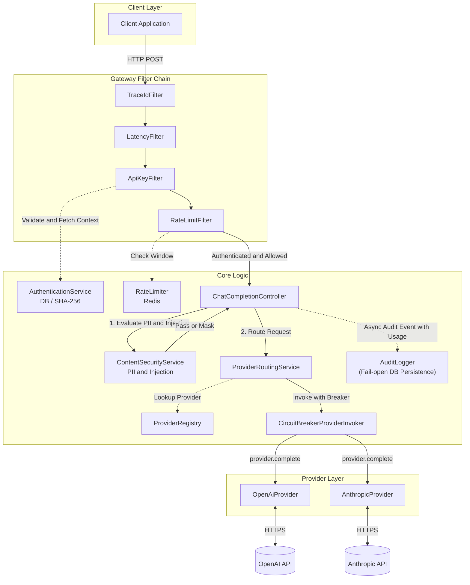

# Policy-Aware Multi-LLM Gateway

> LLM / Agent 呼び出しを本番運用するための運用統治レイヤー（Gateway）
>
> Spring Boot 製 LLM Gateway を、Terraform / ECS Fargate / GitHub Actions OIDC により AWS 上で検証可能にした、本番運用を意識した個人開発・検証構成。

アプリケーションと LLM プロバイダの間に配置し、認証、プロバイダ抽象化、レート制御、可用性、安全性、監査性を一元的に扱う。

---

## ポートフォリオ内での位置づけ

本リポジトリは、生成AIを業務システムへ安全に導入するための
「品質保証 × 動的制御 × 運用統治」3層構成のポートフォリオの
**第3弾「運用統治」** に位置づけられます。

| 位置 | リポジトリ | レイヤー |
|---|---|---|
| 第1弾 | [Retrieval品質管理システム](https://github.com/mlprototype/spec-rag-qa) | 品質保証 |
| 第2弾 | [Agentic RAG with Control Plane](https://github.com/mlprototype/ai-agent-rag) | 動的制御 |
| **第3弾** | **本リポジトリ（Policy-Aware Multi-LLM Gateway）** | **運用統治 / AWS運用基盤** |

---

## 解決する課題

LLM/Agent を本番で運用する際、コスト暴走・プロバイダ障害・PII 流出・監査要件
への対応が必要になる。

## システム概要

本プロジェクトは、これらを横断的に統治する Gateway 層を、
Spring Boot / Flyway / Redis / structured logging を土台に段階的に実装する設計探索である。
単に AI を呼び出せるだけでなく、安全に使え、障害時に劣化運転でき、後から追跡できることを重視している。

AWS 検証環境では、Terraform による IaC、ECS Fargate へのコンテナ配備、Secrets Manager、CloudWatch、GitHub Actions OIDC を組み合わせる。アプリケーション機能に加え、デプロイ、シークレット管理、可観測性、コスト管理までを一貫して検証できるようにしている。

## Key Features

- OpenAI 互換 API Gateway と OpenAI / Anthropic Provider 抽象化
- Tenant-based API Key 認証、Redis-based Rate Limiting、Circuit Breaker / Fallback Routing
- PII Detection、Prompt Injection Detection、非同期 Audit Log、構造化 JSON Logging
- Prometheus / Grafana によるローカル可観測性と、local/dev 向け Swagger UI / OpenAPI
- Terraform による AWS Infrastructure（ECS Fargate、ECR、CloudWatch、Secrets Manager、RDS）
- GitHub Actions OIDC による CI/CD、ECS Exec smoke test、失敗時の自動 rollback
- S3 Remote State と native locking、Zero-Idle のコスト最適化設計

## 想定ユースケース

#### 複数業務アプリからのLLM利用を安全に統制するGateway

複数の業務システムやAIアプリケーションが、社内共通のLLM Gateway経由でLLM APIを利用するケースを想定。

各アプリケーションが個別にLLM APIを直接呼び出すと、以下の課題が発生する。

- APIキー管理がアプリごとに分散する
- テナントやプロジェクト単位の利用制御が難しい
- Rate Limitやコスト制御が統一できない
- LLMプロバイダー障害時のFallbackが各アプリ実装になる
- PII検知やプロンプトインジェクション対策が分散する
- 監査ログやメトリクスが統一されない
- 運用・監視・セキュリティポリシーがアプリごとにばらつく

このシステムでは、Spring Boot 3でLLM Gatewayを構築し、LLM利用時の非機能要件をGateway側に分離・共通化する。

---

## アーキテクチャ


```mermaid
graph TD
    subgraph Client Layer
        C[Client Application]
    end

    subgraph Gateway Filter Chain
        F1[TraceIdFilter] --> F2[LatencyFilter]
        F2 --> F3[ApiKeyFilter]
        F3 --> F4[RateLimitFilter]
    end

    subgraph Core Logic
        Auth[AuthenticationService<br/>DB / SHA-256]
        RL[RateLimiter<br/>Redis]
        Ctrl[ChatCompletionController]
        Security["ContentSecurityService<br/>PII and Injection"]
        Router[ProviderRoutingService]
        Registry[ProviderRegistry]
        CB[CircuitBreakerProviderInvoker]
        Audit["AuditLogger<br/>(Fail-open DB Persistence)"]
    end

    subgraph Provider Layer
        OpenAI[OpenAiProvider]
        Anthropic[AnthropicProvider]
    end

    C -->|HTTP POST| F1
    F3 -.->|Validate and Fetch Context| Auth
    F4 -.->|Check Window| RL
    F4 -->|Authenticated and Allowed| Ctrl
    Ctrl -->|1. Evaluate PII and Injection| Security
    Security -->|Pass or Mask| Ctrl
    Ctrl -->|2. Route Request| Router
    Router -.->|Lookup Provider| Registry
    Router -->|Invoke with Breaker| CB
    CB -->|provider.complete| OpenAI
    CB -->|provider.complete| Anthropic
    OpenAI <-->|HTTPS| ExtO[(OpenAI API)]
    Anthropic <-->|HTTPS| ExtA[(Anthropic API)]

    Ctrl -.->|Async Audit Event with Usage| Audit
```

### AWS Architecture

AWS 上の構成、CI/CD、Secrets 管理、Zero-Idle 設計の詳細は以下を参照してください。

- [AWS Architecture](docs/infra/AWS_ARCHITECTURE.md)
- [CI/CD Pipeline](docs/infra/CI_CD_PIPELINE.md)
- [Security Model](docs/infra/SECURITY_MODEL.md)
- [Operations Runbook](docs/infra/OPERATIONS_RUNBOOK.md)
- [Cost Optimization Strategy](docs/infra/COST_OPTIMIZATION.md)
- [Terraform Deployment Guide](infra/aws/TERRAFORM_DEPLOYMENT_GUIDE.md)

**Response Headers** — 全レスポンスに Gateway 拡張ヘッダが付与されます:

| Header | Description |
|:---|:---|
| `X-Gateway-Trace-Id` | リクエスト固有の UUID（MDC でログに連携） |
| `X-Gateway-Latency-Ms` | Gateway 内の処理時間 (ms) |
| `X-Gateway-Requested-Provider` | リクエストで要求された provider 名 |
| `X-Gateway-Provider` | **実解決値** (ルーティング後に実際に使用されたプロバイダ名) |
| `X-Gateway-Fallback-Used` | fallback routing が実行されたか (`true` / `false`) |
| `X-RateLimit-Limit` | テナントごとの 1 分間あたりのリクエスト上限 |
| `X-RateLimit-Remaining` | 現在の 1 分間における残りリクエスト可能数 |
| `X-Gateway-Security-Blocked` | セキュリティポリシー違反によりブロックされた場合 (`true`) |
| `X-Gateway-Block-Reason` | ブロック理由 (`PII_DETECTED`, `INJECTION_DETECTED`) |
| `X-Gateway-Security-Score` | Prompt Injection BLOCK 時の検知スコア |
| `X-Gateway-Security-Categories` | Prompt Injection BLOCK 時に一致したカテゴリ（カンマ区切り） |

---

## 設計思想

| 判断 | 選定 | Why |
|:---|:---|:---|
| Web 層 | Spring MVC + Virtual Threads | リアクティブの複雑性回避、JPA/Redis 親和性 |
| API I/F | OpenAI 互換 | 既存 SDK 流用、ロックイン回避 |
| Provider 抽象化 | Interface + Mapper | LLM プロバイダ追加を低コスト化 |
| 認証方式 (Sprint 2) | DB (SHA-256) | deterministic hash による lookup simplicity を優先。stronger secret rotation / vault integration は future work。 |
| レートリミット (Sprint 2) | Redis Fixed-Window | Fail-open 設計 (Redis 障害時でもリクエストをブロックしない)。Retry-After は現状 60 秒固定 (将来 window 残り時間へ改善可能)。 |
| 可用性戦略 (Sprint 3) | controlled degradation | timeout / 5xx / breaker-open 時に single-step fallback を許可し、provider 4xx や invalid response は隠蔽しすぎない。 |
| セキュリティ監査 (Sprint 4) | ContentSecurityService + Async AuditDB | PIIマスキングやインジェクション検知をルーティング前に実施。監査ログ保存はDBダウン時にもメインフローを止めない Fail-open 設計。テナントごとのポリシー(BLOCK, MASK, WARN)を動的に適用。 |
| APIドキュメント | springdoc-openapi / Swagger UI | curl だけに依存せず、local/dev 環境で API 仕様と試行導線を提供。本番では Swagger UI を無効化する想定。 |
| ビルドツール | Gradle (Groovy DSL) | Spring Boot 標準、CI キャッシュ親和性 |
---

## 技術スタック

| Component | Technology |
|:---|:---|
| Language | Java 21 |
| Framework | Spring Boot 3.5.x |
| Web | Spring MVC + Virtual Threads |
| Database | PostgreSQL + Flyway |
| Cache | Redis |
| Resilience | Resilience4j |
| Observability | Structured JSON Logging, Prometheus, Grafana, CloudWatch |
| API Docs | springdoc-openapi / Swagger UI |
| Container | Docker, Docker Compose |
| Cloud | AWS ECS Fargate, ECR, RDS, Secrets Manager, CloudWatch |
| IaC | Terraform, S3 Remote State, S3 Native Locking |
| CI/CD | GitHub Actions, OIDC, ECR Push, ECS Deploy, Smoke Test, Auto Rollback |
| Build | Gradle |

---

## Quick Start - Local Development

### Prerequisites

- Java 21
- Docker & Docker Compose

### 1. Setup

```bash
git clone https://github.com/mlprototype/policy-aware-llm-gateway.git
cd policy-aware-llm-gateway

cp .env.example .env
```

`.env` を編集して API Key を設定:

```dotenv
# === Gateway Authentication ===
# DB投入済みの Dev API Key を使用 (V2_1__seed_dev_tenant.sql 参照)
GATEWAY_API_KEY=dev-gateway-key-001

# === Gateway Security Policy ===
GATEWAY_PII_ACTION=MASK
GATEWAY_INJECTION_ACTION=BLOCK

# === LLM Provider ===
OPENAI_API_KEY=sk-proj-xxxxxxxxxxxxx        # OpenAI API Key
ANTHROPIC_API_KEY=sk-ant-xxxxxxxxxxxxxxxx   # Anthropic API Key
```

### 2. Run with Docker Compose

```bash
docker compose up --build -d
```

- `app` (Gateway 本体) — port 8080
- `postgres` (PostgreSQL 16) — port 5433
- `redis` (Redis 7) — port 6379

### 3. Smoke Test

```bash
# ✅ OpenAI Proxy — 正常リクエスト
source .env
curl -s http://localhost:8080/v1/chat/completions \
  -H "Content-Type: application/json" \
  -H "X-API-Key: $GATEWAY_API_KEY" \
  -d '{
    "messages": [{"role": "user", "content": "日本語で一言あいさつしてください"}],
    "max_tokens": 10
  }' | jq .

# → {"id":"chatcmpl-...","model":"gpt-4o-mini-2024-07-18",
#    "choices":[{"message":{"content":"こんにちは！"}}]}

# ❌ Auth Failure — API Key なし
curl -s http://localhost:8080/v1/chat/completions \
  -H "Content-Type: application/json" \
  -d '{"messages": [{"role": "user", "content": "こんにちは"}]}' | jq .

# → {"status":401,"error":"Unauthorized","message":"Invalid or missing API key",
#    "trace_id":"..."}

# 💚 Health Check — 認証不要
curl -s http://localhost:8080/actuator/health | jq .

# → {"status":"UP"}
```

### 4. Observability Dashboard

Sprint 5 より、Prometheus と Grafana を使った可観測性が追加されました。

1. `docker compose up -d` 実行後、数十秒〜1分程度待機します（Prometheus がメトリクスを収集し、Grafana がダッシュボードをプロビジョニングするため）。
2. ブラウザで Grafana (`http://localhost:3000`) にアクセスします。
   - ログインは不要です（ローカルデモ用途の簡易設定として匿名アクセスが有効化されています。本番環境での推奨設定ではありません）。
3. **LLM Gateway Overview** ダッシュボードが自動的にロードされ、以下の情報が視覚的に確認できます。
   - Gateway Total Requests (RPS)
   - Provider Error Rate & HTTP Request Latency
   - Rate Limit Rejects & Security Blocks / Warns

### Run Locally (without Docker)

PostgreSQL and Redis must be running locally before starting the application.

```bash
SPRING_PROFILES_ACTIVE=local ./gradlew bootRun
```

### Swagger UI (local/dev)

Swagger UI は local/dev 環境で有効化する想定です。`local` profile ではデフォルトで有効になり、以下の URL から OpenAPI ドキュメントを確認できます。

- Swagger UI: `http://localhost:8080/swagger-ui.html`
- OpenAPI JSON: `http://localhost:8080/v3/api-docs`

Docker やデモ用途で `local` profile を使わずに有効化したい場合は、環境変数で切り替えられます。

```bash
SPRINGDOC_API_DOCS_ENABLED=true
SPRINGDOC_SWAGGER_UI_ENABLED=true
```

Swagger UI の `Try it out` はモックではなく、実際に `/v1/chat/completions` を呼び出します。そのため、通常の API 呼び出しと同じく `X-API-Key` が必要で、実際に LLM Provider へリクエストが送信されます。

Swagger UI / OpenAPI endpoint はドキュメント閲覧のため認証・RateLimit の対象外にしていますが、実 API の認証・RateLimit・Security・Audit の挙動は変更していません。本番環境では `SPRINGDOC_API_DOCS_ENABLED=false`, `SPRINGDOC_SWAGGER_UI_ENABLED=false` のまま運用し、Swagger UI を無効化する想定です。

---

## Quick Start - AWS Verification

AWS 上の検証では Terraform と GitHub Actions OIDC を利用します。通常は `desired_count = 0` とし、検証時だけ RDS と ECS タスクを起動します。詳細手順は README ではなく、以下の運用ドキュメントを参照してください。

- [Terraform Deployment Guide](infra/aws/TERRAFORM_DEPLOYMENT_GUIDE.md)
- [Operations Runbook](docs/infra/OPERATIONS_RUNBOOK.md)

---

## API Reference

### `POST /v1/chat/completions`

OpenAI Chat Completions API 互換エンドポイント。

**Headers:**

| Header | Required | Description |
|:---|:---|:---|
| `X-API-Key` | ✅ | Gateway 認証キー (DBのテナントと紐付け) |
| `X-Gateway-Requested-Provider` | - | 使用プロバイダの**要求値** (`openai` または `anthropic` / default: `openai`) |
| `X-Gateway-Provider` | - | request では legacy alias。response では**実解決値**を返す |
| `X-Request-Id` | - | クライアント指定のトレース ID |

**Request Body:**

```json
{
  "model": "gpt-4o-mini",
  "messages": [
    {
      "role": "system",
      "content": "あなたは優秀なカスタマーサポートアシスタントです。ユーザーからの問い合わせ内容を分析し、対応優先度（高/中/低）と要約を簡潔な日本語で出力してください。"
    },
    {
      "role": "user",
      "content": "【問い合わせ内容】システム移行後から管理画面にログインできなくなりました。「認証エラー」と表示されます。業務への影響が大きいため、至急原因と対策をご連絡ください。"
    }
  ],
  "temperature": 0.2,
  "max_tokens": 512
}
```

**Cost Safety:** `max_tokens` は Gateway 側で上限 4096 にクランプされます。

`model` を指定する場合は選択した Provider と互換性のあるモデル名が必要です。OpenAIモデルを Anthropic に指定するなどの不一致は、Provider 呼び出し前に `400 Bad Request` として拒否します。`model` を省略した場合は Provider ごとのデフォルトモデルを使用します。Anthropicでは `system` 以外に、最低1件の `user` または `assistant` メッセージが必要です。

**Migration Note:** request header は `X-Gateway-Requested-Provider` が正です。`X-Gateway-Provider` を request で送る形式は後方互換のため一時的に許可しています。両方送信して値が不一致の場合は `400 Bad Request` を返します。

### HTTP Semantics

- `400 Bad Request`: 無効なリクエスト形式、Provider/modelの不一致、または PII BLOCK
- `401 Unauthorized`: APIキーの欠落または無効
- `403 Forbidden`: 認証済みだが、テナントが一時停止状態、または Prompt Injection BLOCK
- `429 Too Many Requests`: テナントのレートリミット（利用上限）超過
- `502 Bad Gateway`: アップストリーム（LLMプロバイダ）の 4xx / 5xx エラー、または無効なレスポンス
- `503 Service Unavailable`: タイムアウト / 接続エラー / サーキットブレーカーのオープン状態

### Security & Policies

テナントごとにセキュリティポリシー（PII アクション・インジェクションアクション）を制御可能です。

- **`ALLOW`**: 何もせず通過。
- **`WARN`**: リクエストは通過するが、監査ログに検知フラグを立てて記録。
- **`MASK`**: (PII専用) リクエスト本文の該当文字列を `[EMAIL_REDACTED]` などにマスクして Provider へ送信。
- **`BLOCK`**: PII は 400 Bad Request、Prompt Injection は 403 Forbidden で遮断。アップストリームへは送信しない。

デフォルトでは PII は `MASK`、プロンプトインジェクションは `BLOCK` です。テナントの `pii_action` / `injection_action` が DB で設定されている場合は、テナント設定が優先されます。

Prompt Injection Detection は NFKC・小文字化・format character 除去・空白正規化を行い、通常テキストと空白除去テキストの両方へカテゴリ別ルールを適用します。同一ルールはリクエスト内で一度だけ加点し、合計スコアが 70 以上の場合に Prompt Injection と判定します。`injection_action=BLOCK` の場合は Provider へ送信せず、403 Forbidden で遮断します。

監査ログには `injection_detected`、`injection_action`、`injection_rules`、`injection_score`、`injection_categories` を保存します。一致したユーザー入力そのものはルール情報として保存しません。

> **Note:** PII BLOCK の優先順位は最上位となります。同一リクエスト内で PII とインジェクションが検知された場合、PII のアクションが BLOCK であれば即時エラーとなります。

### Degraded Mode

- fallback は 1 段のみです。`openai -> anthropic`、`anthropic -> openai`
- fallback先と元のモデルに互換性がない場合は、fallback先のデフォルトモデルを使用します
- fallback 対象は `timeout`, `connection error`, `upstream 5xx`, `breaker-open`
- provider 4xx は fallback しません
- `INVALID_RESPONSE` は upstream schema drift と mapper 不整合の両方を含み得るため、Sprint 3 では安全側で fallback 対象外にしています

---

## ディレクトリ構成

```text
.
├── .github/workflows/            # CI / AWS deploy workflow
├── docker/                       # Prometheus / Grafana設定
├── docs/                         # 設計・運用ドキュメント、ADR
├── infra/aws/                    # TerraformによるAWS基盤
├── src/
│   ├── main/java/io/github/mlprototype/gateway/
│   │   ├── api/                  # REST Controller
│   │   ├── audit/                # Structured audit logging
│   │   ├── content/              # PII / Injection filtering
│   │   ├── filter/               # Trace / API Key / Rate Limit filters
│   │   ├── provider/             # LLM Provider abstraction
│   │   ├── router/               # Provider routing / fallback
│   │   └── security/             # Tenant / API Key authentication
│   ├── main/resources/           # Spring profiles / Flyway migration
│   └── test/java/                # Unit / integration tests
├── Dockerfile
├── docker-compose.yml
└── build.gradle
```

---

## 設定

本システムでは、LLM APIキー、Gateway用APIキー、コンテンツセキュリティポリシー、PostgreSQL接続、Redis接続、Resilience4j Circuit Breaker、Swagger UIなどの設定を環境変数や設定ファイル（`application.yml`）で管理しています。

主要な設定カテゴリは以下です。

| カテゴリ | 主な設定内容 |
| :--- | :--- |
| LLM Provider | OpenAI / Anthropic APIキー、デフォルトモデル、タイムアウト秒数、最大トークン制限 |
| Content Security | PII検知・プロンプトインジェクション検知時のデフォルトアクション制御（BLOCK / MASK / WARN / ALLOW） |
| Database / Cache | PostgreSQL接続（テナント管理・非同期監査ログ永続化用）、Redis接続（テナント別レートリミット用） |
| Resilience | Resilience4j Circuit Breaker設定（判定用スライディングウィンドウ、失敗閾値、除外例外など）とフォールバック制御 |
| Observability / API Docs | Actuator/Prometheus連携（メトリクス公開）、JSON構造化ログ、Swagger UI / OpenAPIの有効化 |

詳細な環境変数一覧とデフォルト値は [`docs/configuration.md`](docs/configuration.md) を参照してください。

各デフォルト値は個人開発・検証環境向けの初期値であり、本番利用時は対象データ、レイテンシ要件、APIコスト、評価結果に応じて調整する想定です。

---

## AWS Deployment & Cost Strategy

Terraform で [AWS 基盤](infra/aws/) を管理し、ECS Fargate、ECR、CloudWatch、IAM、Security Group、Secrets Manager を組み合わせて Gateway を検証する。RDS PostgreSQL は起動検証時のみ有効化し、Redis と ALB も必要時だけ作成する。本番運用を意識した個人開発・検証構成であり、常時稼働する商用構成ではない。

### State and Secrets

- Terraform state は S3 remote backend で管理し、versioning、暗号化、public access block、`use_lockfile = true` を有効化する。
- GitHub Actions の Terraform plan は remote state と AWS 実リソースを参照する。`-backend=false`、`-lock=false`、`-refresh=false` は使用しない。
- API Key の実値は Secrets Manager へ直接登録し、Terraform state に保存しない。CI Role には `secretsmanager:GetSecretValue` を付与しない。

### CI/CD Verification

- `ci.yml` は全 push / pull request で `./gradlew test` と artifact build を実行する。
- `deploy.yml` は対象パスを含む `main` への push と手動実行で、Terraform plan、Git SHA タグの ECR push、ECS Task Definition 更新を実行する。
- デプロイ後はタスクを一時的に起動し、ECS Exec から `/actuator/health` を確認する。失敗時は直前の Task Definition と起動数へ自動 rollback する。
- CI Runner の可変 IP に合わせて Security Group を広げず、コンテナ内部から health check する。

### Zero-Idle Cost Control

`desired_count = 0` を通常状態とし、検証後は ECS タスクを停止する。RDS、Redis、ALB はトグルを `false` に戻して選別削除し、ECR、Secrets Manager、IAM、remote state は次回検証のため保持する。

詳細は [AWS Architecture](docs/infra/AWS_ARCHITECTURE.md)、[CI/CD Pipeline](docs/infra/CI_CD_PIPELINE.md)、[Security Model](docs/infra/SECURITY_MODEL.md)、[Cost Optimization Strategy](docs/infra/COST_OPTIMIZATION.md) を参照してください。

---

## Documentation

### Architecture and Operations

- [AWS Architecture](docs/infra/AWS_ARCHITECTURE.md)
- [CI/CD Pipeline](docs/infra/CI_CD_PIPELINE.md)
- [Security Model](docs/infra/SECURITY_MODEL.md)
- [Operations Runbook](docs/infra/OPERATIONS_RUNBOOK.md)
- [Cost Optimization Strategy](docs/infra/COST_OPTIMIZATION.md)
- [Terraform Deployment Guide](infra/aws/TERRAFORM_DEPLOYMENT_GUIDE.md)

### Architecture Decision Records

- [ADR-001: Use ECS Fargate](docs/adr/001-use-ecs-fargate.md)
- [ADR-002: Use S3 Remote State](docs/adr/002-use-s3-remote-state.md)
- [ADR-003: Use GitHub Actions OIDC](docs/adr/003-use-github-actions-oidc.md)
- [ADR-004: Manage Secret Values Outside Terraform State](docs/adr/004-secrets-manager-without-secret-version.md)
- [ADR-005: Adopt Zero-Idle Architecture](docs/adr/005-zero-idle-cost-strategy.md)
- [ADR-006: Use ECS Exec for Smoke Test](docs/adr/006-ecs-exec-smoke-test.md)

### Configuration

- [Configuration Reference](docs/configuration.md)

---

## Testing

```bash
# Unit + Integration tests (mock-based, no API call)
./gradlew test

# Local smoke test (Docker health / basic request)
docker compose up -d
source .env

# 1. OpenAI (Default)
curl -s http://localhost:8080/v1/chat/completions \
  -H "Content-Type: application/json" \
  -H "X-API-Key: $GATEWAY_API_KEY" \
  -d '{"messages":[{"role":"user","content":"日本語で一言あいさつしてください"}],"max_tokens":10}'

# 2. Anthropic
curl -s http://localhost:8080/v1/chat/completions \
  -H "Content-Type: application/json" \
  -H "X-API-Key: $GATEWAY_API_KEY" \
  -H "X-Gateway-Requested-Provider: anthropic" \
  -d '{"messages":[{"role":"user","content":"2+2はいくつですか。日本語で短く答えてください。"}],"max_tokens":10}'

# 3. Suspended tenant (403)
curl -s http://localhost:8080/v1/chat/completions \
  -H "Content-Type: application/json" \
  -H "X-API-Key: suspended-key-001" \
  -d '{"messages":[{"role":"user","content":"こんにちは"}]}'

# 4. Rate limit exceeded (429)
for i in {1..5}; do
  curl -i -s http://localhost:8080/v1/chat/completions \
    -H "Content-Type: application/json" \
    -H "X-API-Key: $GATEWAY_API_KEY" \
    -d '{"messages":[{"role":"user","content":"疎通確認です"}],"max_tokens":5}'
done

# 5. PII blocked request (400)
curl -i -s http://localhost:8080/v1/chat/completions \
  -H "Content-Type: application/json" \
  -H "X-API-Key: $GATEWAY_API_KEY" \
  -d '{"messages":[{"role":"user","content":"私のメールアドレスは user@example.com です"}],"max_tokens":5}'
```

---

## Sprint Roadmap

| Sprint | Focus | Status |
|:---|:---|:---|
| **1** | Gateway 骨格, OpenAI proxy, API Key 認証, trace/audit, Docker | ✅ Done |
| **2** | Anthropic provider, tenant 認証 (DB), rate limiting, Redis | ✅ Done |
| **3** | Circuit Breaker (Resilience4j), fallback routing | ✅ Done |
| **4** | PII masking, prompt injection detection, audit DB 永続化 | ✅ Done |
| **5** | Prometheus / Grafana dashboard | ✅ Done |

---

## Current Status

### Application Features

- OpenAI / Anthropic の複数 Provider と OpenAI 互換 API
- DB のテナント情報と SHA-256 hash を用いた API Key 認証
- Redis fixed-window の rate limiting（Redis 障害時は fail-open）
- Circuit Breaker と timeout / 5xx / breaker-open 時の single-step fallback
- PII 検知・マスキング、Prompt Injection 検知、テナントごとのポリシー
- リクエストのハッシュ、サニタイズ済みプレビュー、利用量を保存する非同期 Audit Log
- Prometheus / Grafana、構造化ログ、local/dev 向け Swagger UI / OpenAPI

### AWS / DevOps

- Terraform 管理の AWS Infrastructure と ECS Fargate deployment
- Git SHA タグによる ECR image push と CloudWatch Logs / Dashboard
- S3 remote state、versioning、encryption、native locking
- GitHub Actions OIDC と remote state を参照する Terraform plan
- ECS Exec による内部 smoke test と失敗時の自動 rollback
- Terraform state に Secret 値を保存しない Secrets Manager 運用
- `desired_count = 0` を基本とする Zero-Idle cleanup strategy

---

## 既知の制限

| 分類 | 制約事項 |
| :--- | :--- |
| **Security** | ルールベースの実装であるため、PIIやプロンプトインジェクションの誤検知（False Positive）や検知漏れ（False Negative）が発生する可能性あり |
| **Security** | 出力（レスポンス）側に対する情報の秘匿化（リダクション）は未実装 |
| **Audit Log** | フェイルオープンかつ非同期で動作。現時点では、厳密な配信保証（Strong Delivery Guarantees）はスコープ外 |
| **Authentication** | APIキーはDBにSHA-256ハッシュで保存。より強固なシークレット管理メカニズムよりも、決定論的な検索（Lookup）の簡便性を優先している |
| **Routing** | シングルステップのみのフォールバック対応であり、コストやレイテンシを考慮した高度なルーティングは含まれていない |
| **AWS Topology** | 個人開発・検証構成であり、商用本番運用済みの構成ではない。既定では低コスト優先の Public Subnet 検証構成を使う |
| **AWS Services** | Redis と ALB は optional であり、デフォルトでは作成しない |
| **Availability** | Private Subnet、WAF、Auto Scaling、Multi-AZ、厳密な SLA / DR、Blue-Green Deployment は未対応 |
| **Providers** | AWS Bedrock Provider と Azure OpenAI Provider は未実装 |

---

## 今後の展望

以下は現時点で未実装だが、次のフェーズでの対応を検討している改善候補です。

- **AWS Bedrock / Azure OpenAI Provider**: Provider 抽象化を活かしたクラウド LLM Provider の追加。
- **Security scanning**: Trivy、Checkov、Dependabot を CI/CD に組み込み、依存関係・コンテナ・IaC を継続的に確認する。
- **Production-like AWS topology**: Private Subnet、ALB、WAF、Auto Scaling、CloudWatch Alarm、Budget Alert を含む構成の検証。
- **Admin UI**: React / TypeScript による最小限のテナント・ポリシー確認画面。
- **AIベースのPII・プロンプトインジェクション検知**: ルールベースの検知から、軽量なローカルLLMや専用のGuardrailsモデルを用いた、コンテキスト依存の高度な検知への移行。
- **レスポンス側の出力リダクション**: リクエスト内容だけでなく、LLMからのレスポンスに含まれるPIIや不適切な表現をリアルタイムで検知・マスキングする機能の追加。
- **高信頼性監査ログの配信保証**: Fail-open設計の非同期ログ保存に加え、メッセージキュー（KafkaやRabbitMQ等）を導入し、厳密なログの配信保証（At-least-once）とトレーサビリティの向上を実現。
- **ダイナミックかつインテリジェントなルーティング**: 静的なシングルステップ・フォールバックだけでなく、プロバイダーのリアルタイムなレイテンシ、コスト、エラー率、レートリミット上限を学習し、動的に最適なLLMルートを選択するインテリジェントルーティングの実装。
- **シークレット管理の統合**: APIキーのハッシュ化によるインメモリDB管理から、HashiCorp VaultやクラウドのSecret Manager（AWS, GCP等）と統合した、より堅牢でスケーラブルな鍵管理。
