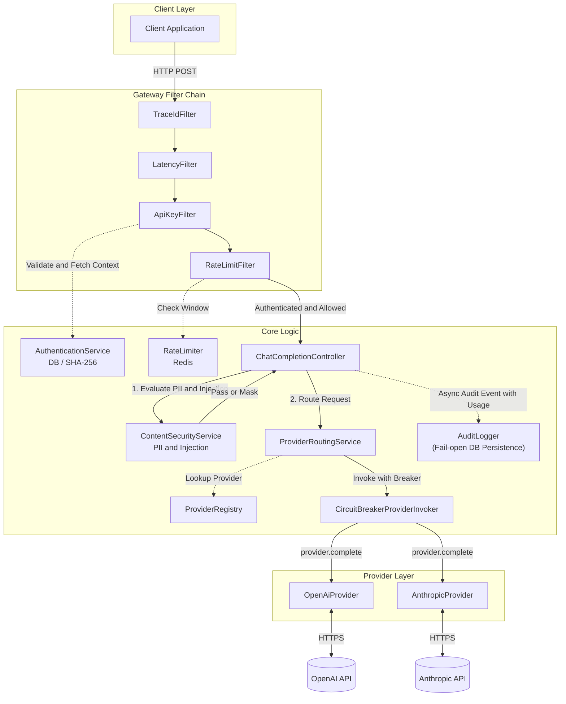

# Policy-Aware Multi-LLM Gateway

> LLM / Agent呼び出しを本番運用するための運用統治レイヤー（Gateway）

アプリケーションと LLM プロバイダの間に配置し、認証、プロバイダ抽象化、レート制御、可用性、安全性、監査性を一元的に扱う。

---

## ポートフォリオ内での位置づけ

本リポジトリは、生成AIを業務システムへ安全に導入するための
「品質保証 × 動的制御 × 運用統治」3層構成のポートフォリオの
**第3弾「運用統治」** に位置づけられます。

| 位置 | リポジトリ | レイヤー |
|---|---|---|
| 第1弾 | [Retrieval品質管理システム](https://github.com/mlprototype/spec-rag-qa) | 品質保証 |
| 第2弾 | [Agentic RAG with Control Plane](https://github.com/mlprototype/ai-agent-rag) | 動的制御 |
| **第3弾** | **本リポジトリ（Policy-Aware Multi-LLM Gateway）** | **運用統治** |

---

## 解決する課題

LLM/Agent を本番で運用する際、コスト暴走・プロバイダ障害・PII 流出・監査要件
への対応が必要になる。

## システム概要

本プロジェクトは、これらを横断的に統治する Gateway 層を、
Spring Boot / Flyway / Redis / structured logging を土台に段階的に実装する設計探索である。
単に AI を呼び出せるだけでなく、安全に使え、障害時に劣化運転でき、後から追跡できることを重視している。

---

## アーキテクチャ


```mermaid
graph TD
    subgraph Client Layer
        C[Client Application]
    end

    subgraph Gateway Filter Chain
        F1[TraceIdFilter] --> F2[LatencyFilter]
        F2 --> F3[ApiKeyFilter]
        F3 --> F4[RateLimitFilter]
    end

    subgraph Core Logic
        Auth[AuthenticationService<br/>DB / SHA-256]
        RL[RateLimiter<br/>Redis]
        Ctrl[ChatCompletionController]
        Security["ContentSecurityService<br/>PII and Injection"]
        Router[ProviderRoutingService]
        Registry[ProviderRegistry]
        CB[CircuitBreakerProviderInvoker]
        Audit["AuditLogger<br/>(Fail-open DB Persistence)"]
    end

    subgraph Provider Layer
        OpenAI[OpenAiProvider]
        Anthropic[AnthropicProvider]
    end

    C -->|HTTP POST| F1
    F3 -.->|Validate and Fetch Context| Auth
    F4 -.->|Check Window| RL
    F4 -->|Authenticated and Allowed| Ctrl
    Ctrl -->|1. Evaluate PII and Injection| Security
    Security -->|Pass or Mask| Ctrl
    Ctrl -->|2. Route Request| Router
    Router -.->|Lookup Provider| Registry
    Router -->|Invoke with Breaker| CB
    CB -->|provider.complete| OpenAI
    CB -->|provider.complete| Anthropic
    OpenAI <-->|HTTPS| ExtO[(OpenAI API)]
    Anthropic <-->|HTTPS| ExtA[(Anthropic API)]

    Ctrl -.->|Async Audit Event with Usage| Audit
```

**Response Headers** — 全レスポンスに Gateway 拡張ヘッダが付与されます:

| Header | Description |
|:---|:---|
| `X-Gateway-Trace-Id` | リクエスト固有の UUID（MDC でログに連携） |
| `X-Gateway-Latency-Ms` | Gateway 内の処理時間 (ms) |
| `X-Gateway-Requested-Provider` | リクエストで要求された provider 名 |
| `X-Gateway-Provider` | **実解決値** (ルーティング後に実際に使用されたプロバイダ名) |
| `X-Gateway-Fallback-Used` | fallback routing が実行されたか (`true` / `false`) |
| `X-RateLimit-Limit` | テナントごとの 1 分間あたりのリクエスト上限 |
| `X-RateLimit-Remaining` | 現在の 1 分間における残りリクエスト可能数 |
| `X-Gateway-Security-Blocked` | セキュリティポリシー違反によりブロックされた場合 (`true`) |
| `X-Gateway-Block-Reason` | ブロック理由 (`PII_DETECTED`, `INJECTION_DETECTED`) |

---

## 設計思想

| 判断 | 選定 | Why |
|:---|:---|:---|
| Web 層 | Spring MVC + Virtual Threads | リアクティブの複雑性回避、JPA/Redis 親和性 |
| API I/F | OpenAI 互換 | 既存 SDK 流用、ロックイン回避 |
| Provider 抽象化 | Interface + Mapper | LLM プロバイダ追加を低コスト化 |
| 認証方式 (Sprint 2) | DB (SHA-256) | deterministic hash による lookup simplicity を優先。stronger secret rotation / vault integration は future work。 |
| レートリミット (Sprint 2) | Redis Fixed-Window | Fail-open 設計 (Redis 障害時でもリクエストをブロックしない)。Retry-After は現状 60 秒固定 (将来 window 残り時間へ改善可能)。 |
| 可用性戦略 (Sprint 3) | controlled degradation | timeout / 5xx / breaker-open 時に single-step fallback を許可し、provider 4xx や invalid response は隠蔽しすぎない。 |
| セキュリティ監査 (Sprint 4) | ContentSecurityService + Async AuditDB | PIIマスキングやインジェクション検知をルーティング前に実施。監査ログ保存はDBダウン時にもメインフローを止めない Fail-open 設計。テナントごとのポリシー(BLOCK, MASK, WARN)を動的に適用。 |
| APIドキュメント | springdoc-openapi / Swagger UI | curl だけに依存せず、local/dev 環境で API 仕様と試行導線を提供。本番では Swagger UI を無効化する想定。 |
| ビルドツール | Gradle (Groovy DSL) | Spring Boot 標準、CI キャッシュ親和性 |
---

## 技術スタック

| Component | Technology |
|:---|:---|
| Language | Java 21 (Virtual Threads) |
| Framework | Spring Boot 3.5.14 |
| Web | Spring MVC + Virtual Threads |
| HTTP Client | RestClient |
| Database | PostgreSQL 16 + Flyway |
| Cache | Redis 7 |
| Logging | Logback + logstash-logback-encoder (structured JSON) |
| Resilience | Resilience4j (Circuit Breaker) |
| API Docs | springdoc-openapi / Swagger UI |
| Build | Gradle 8.14 |
| Container | Docker Compose |
| CI | GitHub Actions |

---

## Quick Start

### Prerequisites

- Java 21
- Docker & Docker Compose

### 1. Setup

```bash
git clone https://github.com/mlprototype/policy-aware-llm-gateway.git
cd policy-aware-llm-gateway

cp .env.example .env
```

`.env` を編集して API Key を設定:

```dotenv
# === Gateway Authentication ===
# DB投入済みの Dev API Key を使用 (V2_1__seed_dev_tenant.sql 参照)
GATEWAY_API_KEY=dev-gateway-key-001

# === Gateway Security Policy ===
GATEWAY_PII_ACTION=MASK
GATEWAY_INJECTION_ACTION=BLOCK

# === LLM Provider ===
OPENAI_API_KEY=sk-proj-xxxxxxxxxxxxx        # OpenAI API Key
ANTHROPIC_API_KEY=sk-ant-xxxxxxxxxxxxxxxx   # Anthropic API Key
```

### 2. Run with Docker Compose

```bash
docker compose up --build -d
```

- `app` (Gateway 本体) — port 8080
- `postgres` (PostgreSQL 16) — port 5433
- `redis` (Redis 7) — port 6379

### 3. Smoke Test

```bash
# ✅ OpenAI Proxy — 正常リクエスト
source .env
curl -s http://localhost:8080/v1/chat/completions \
  -H "Content-Type: application/json" \
  -H "X-API-Key: $GATEWAY_API_KEY" \
  -d '{
    "messages": [{"role": "user", "content": "日本語で一言あいさつしてください"}],
    "max_tokens": 10
  }' | jq .

# → {"id":"chatcmpl-...","model":"gpt-4o-mini-2024-07-18",
#    "choices":[{"message":{"content":"こんにちは！"}}]}

# ❌ Auth Failure — API Key なし
curl -s http://localhost:8080/v1/chat/completions \
  -H "Content-Type: application/json" \
  -d '{"messages": [{"role": "user", "content": "こんにちは"}]}' | jq .

# → {"status":401,"error":"Unauthorized","message":"Invalid or missing API key",
#    "trace_id":"..."}

# 💚 Health Check — 認証不要
curl -s http://localhost:8080/actuator/health | jq .

# → {"status":"UP"}
```

### 4. Observability Dashboard

Sprint 5 より、Prometheus と Grafana を使った可観測性が追加されました。

1. `docker compose up -d` 実行後、数十秒〜1分程度待機します（Prometheus がメトリクスを収集し、Grafana がダッシュボードをプロビジョニングするため）。
2. ブラウザで Grafana (`http://localhost:3000`) にアクセスします。
   - ログインは不要です（ローカルデモ用途の簡易設定として匿名アクセスが有効化されています。本番環境での推奨設定ではありません）。
3. **LLM Gateway Overview** ダッシュボードが自動的にロードされ、以下の情報が視覚的に確認できます。
   - Gateway Total Requests (RPS)
   - Provider Error Rate & HTTP Request Latency
   - Rate Limit Rejects & Security Blocks / Warns

### Run Locally (without Docker)

PostgreSQL and Redis must be running locally before starting the application.

```bash
SPRING_PROFILES_ACTIVE=local ./gradlew bootRun
```

### Swagger UI (local/dev)

Swagger UI は local/dev 環境で有効化する想定です。`local` profile ではデフォルトで有効になり、以下の URL から OpenAPI ドキュメントを確認できます。

- Swagger UI: `http://localhost:8080/swagger-ui.html`
- OpenAPI JSON: `http://localhost:8080/v3/api-docs`

Docker やデモ用途で `local` profile を使わずに有効化したい場合は、環境変数で切り替えられます。

```bash
SPRINGDOC_API_DOCS_ENABLED=true
SPRINGDOC_SWAGGER_UI_ENABLED=true
```

Swagger UI の `Try it out` はモックではなく、実際に `/v1/chat/completions` を呼び出します。そのため、通常の API 呼び出しと同じく `X-API-Key` が必要で、実際に LLM Provider へリクエストが送信されます。

Swagger UI / OpenAPI endpoint はドキュメント閲覧のため認証・RateLimit の対象外にしていますが、実 API の認証・RateLimit・Security・Audit の挙動は変更していません。本番環境では `SPRINGDOC_API_DOCS_ENABLED=false`, `SPRINGDOC_SWAGGER_UI_ENABLED=false` のまま運用し、Swagger UI を無効化する想定です。

---

## API Reference

### `POST /v1/chat/completions`

OpenAI Chat Completions API 互換エンドポイント。

**Headers:**

| Header | Required | Description |
|:---|:---|:---|
| `X-API-Key` | ✅ | Gateway 認証キー (DBのテナントと紐付け) |
| `X-Gateway-Requested-Provider` | ❌ | 使用プロバイダの**要求値** (`openai` または `anthropic` / default: `openai`) |
| `X-Gateway-Provider` | ❌ | request では legacy alias。response では**実解決値**を返す |
| `X-Request-Id` | ❌ | クライアント指定のトレース ID |

**Request Body:**

```json
{
  "model": "gpt-4o-mini",
  "messages": [
    {"role": "system", "content": "あなたは日本語で簡潔に回答するアシスタントです。"},
    {"role": "user", "content": "こんにちは。今日の作業を一言で励ましてください。"}
  ],
  "temperature": 0.7,
  "max_tokens": 1024
}
```

**Cost Safety:** `max_tokens` は Gateway 側で上限 4096 にクランプされます。

**Migration Note:** request header は `X-Gateway-Requested-Provider` が正です。`X-Gateway-Provider` を request で送る形式は後方互換のため一時的に許可しています。両方送信して値が不一致の場合は `400 Bad Request` を返します。

### HTTP Semantics

- `400 Bad Request`: 無効なリクエスト形式、またはセキュリティポリシー違反（PII/インジェクションによるブロック）
- `401 Unauthorized`: APIキーの欠落または無効
- `403 Forbidden`: 認証済みだが、テナントが一時停止状態
- `429 Too Many Requests`: テナントのレートリミット（利用上限）超過
- `502 Bad Gateway`: アップストリーム（LLMプロバイダ）の 4xx / 5xx エラー、または無効なレスポンス
- `503 Service Unavailable`: タイムアウト / 接続エラー / サーキットブレーカーのオープン状態

### Security & Policies

テナントごとにセキュリティポリシー（PII アクション・インジェクションアクション）を制御可能です。

- **`ALLOW`**: 何もせず通過。
- **`WARN`**: リクエストは通過するが、監査ログに検知フラグを立てて記録。
- **`MASK`**: (PII専用) リクエスト本文の該当文字列を `[EMAIL_REDACTED]` などにマスクして Provider へ送信。
- **`BLOCK`**: 400 Bad Request で遮断。アップストリームへは送信しない。

デフォルトでは PII は `MASK`、プロンプトインジェクションは `BLOCK` です。テナントの `pii_action` / `injection_action` が DB で設定されている場合は、テナント設定が優先されます。

> **Note:** PII BLOCK の優先順位は最上位となります。同一リクエスト内で PII とインジェクションが検知された場合、PII のアクションが BLOCK であれば即時エラーとなります。

### Degraded Mode

- fallback は 1 段のみです。`openai -> anthropic`、`anthropic -> openai`
- fallback 対象は `timeout`, `connection error`, `upstream 5xx`, `breaker-open`
- provider 4xx は fallback しません
- `INVALID_RESPONSE` は upstream schema drift と mapper 不整合の両方を含み得るため、Sprint 3 では安全側で fallback 対象外にしています

---

## ディレクトリ構成

```text
src/main/java/io/github/mlprototype/gateway/
├── api/              # REST Controllers
├── audit/            # Structured audit logging
├── config/           # RestClient, Jackson configuration
├── dto/              # Request / Response DTOs
├── exception/        # Global exception handler
├── filter/           # Servlet filters (TraceId, Latency, ApiKey, RateLimit)
├── content/          # (Sprint 4) Security & Content filtering (PII / Injection)
├── provider/         # LLM Provider abstraction
│   ├── openai/       # OpenAI implementation
│   └── anthropic/    # Anthropic implementation
├── ratelimit/        # Redis-based fixed-window rate limiting
├── router/           # Provider routing logic
└── security/         # Tenant / API client authentication
```

---

## Configuration

主要な設定値 (`application.yml`):

| Property | Default | Description |
|:---|:---|:---|
| `gateway.provider.openai.api-key` | env `OPENAI_API_KEY` | OpenAI API Key |
| `gateway.provider.openai.default-model` | `gpt-4o-mini` | OpenAI デフォルトモデル |
| `gateway.provider.anthropic.api-key` | env `ANTHROPIC_API_KEY` | Anthropic API Key |
| `gateway.provider.anthropic.default-model` | `claude-3-haiku-20240307` | Anthropic デフォルトモデル |
| `gateway.security.pii-action` | env `GATEWAY_PII_ACTION` / `MASK` | PII 検知時のデフォルトアクション |
| `gateway.security.injection-action` | env `GATEWAY_INJECTION_ACTION` / `BLOCK` | プロンプトインジェクション検知時のデフォルトアクション |
| `spring.data.redis.host` | `localhost` / `redis` | Redis host |
| `spring.data.redis.port` | `6379` | Redis port |
| `spring.threads.virtual.enabled` | `true` | Virtual Threads 有効化 |
| `springdoc.api-docs.enabled` | env `SPRINGDOC_API_DOCS_ENABLED` / `false` | OpenAPI JSON endpoint (`/v3/api-docs`) の有効化 |
| `springdoc.swagger-ui.enabled` | env `SPRINGDOC_SWAGGER_UI_ENABLED` / `false` | Swagger UI (`/swagger-ui.html`) の有効化 |
| `springdoc.swagger-ui.path` | `/swagger-ui.html` | Swagger UI の公開パス |
| `springdoc.paths-to-match` | `/v1/**` | OpenAPI ドキュメント対象の API path |

---

## Testing

```bash
# Unit + Integration tests (mock-based, no API call)
./gradlew test

# Local smoke test (Docker health / basic request)
docker compose up -d
source .env

# 1. OpenAI (Default)
curl -s http://localhost:8080/v1/chat/completions \
  -H "Content-Type: application/json" \
  -H "X-API-Key: $GATEWAY_API_KEY" \
  -d '{"messages":[{"role":"user","content":"日本語で一言あいさつしてください"}],"max_tokens":10}'

# 2. Anthropic
curl -s http://localhost:8080/v1/chat/completions \
  -H "Content-Type: application/json" \
  -H "X-API-Key: $GATEWAY_API_KEY" \
  -H "X-Gateway-Requested-Provider: anthropic" \
  -d '{"messages":[{"role":"user","content":"2+2はいくつですか。日本語で短く答えてください。"}],"max_tokens":10}'

# 3. Suspended tenant (403)
curl -s http://localhost:8080/v1/chat/completions \
  -H "Content-Type: application/json" \
  -H "X-API-Key: suspended-key-001" \
  -d '{"messages":[{"role":"user","content":"こんにちは"}]}'

# 4. Rate limit exceeded (429)
for i in {1..5}; do
  curl -i -s http://localhost:8080/v1/chat/completions \
    -H "Content-Type: application/json" \
    -H "X-API-Key: $GATEWAY_API_KEY" \
    -d '{"messages":[{"role":"user","content":"疎通確認です"}],"max_tokens":5}'
done

# 5. PII blocked request (400)
curl -i -s http://localhost:8080/v1/chat/completions \
  -H "Content-Type: application/json" \
  -H "X-API-Key: $GATEWAY_API_KEY" \
  -d '{"messages":[{"role":"user","content":"私のメールアドレスは user@example.com です"}],"max_tokens":5}'
```

---

## Sprint Roadmap

| Sprint | Focus | Status |
|:---|:---|:---|
| **1** | Gateway 骨格, OpenAI proxy, API Key 認証, trace/audit, Docker | ✅ Done |
| **2** | Anthropic provider, tenant 認証 (DB), rate limiting, Redis | ✅ Done |
| **3** | Circuit Breaker (Resilience4j), fallback routing | ✅ Done |
| **4** | PII masking, prompt injection detection, audit DB 永続化 | ✅ Done |
| **5** | Prometheus / Grafana dashboard | ✅ Done |

---

## Current Status

Sprint 5 までで実装済み:

- **Multi-provider support**: OpenAI / Anthropic の 2 Provider に対応
- **Tenant-based authentication**: DB (`tenants`, `api_clients`) と SHA-256 hash による API key 認証
- **Redis-based rate limiting**: tenant 単位の fixed-window rate limiting（fail-open 設計）
- **Circuit Breaker**: provider 単位の Resilience4j breaker
- **Fallback routing**: timeout / 5xx / breaker-open 時の single-step fallback
- **Degraded mode visibility**: requested/resolved provider と fallback 使用有無を response header / structured audit log に出力
- **Content Security**: PII検知/マスキング、プロンプトインジェクション検知、テナントレベルのポリシーエンジン
- **Persistent Audit Log**: リクエストのハッシュ、サニタイズされたプレビュー、使用トークン、レイテンシを DB へ非同期保存（Fail-open 設計）
- **Observability**: Prometheus と Grafana を使用した、RPS、レイテンシ、エラー内訳、フォールバック、セキュリティブロックの可観測性ダッシュボード
- **Swagger UI / OpenAPI**: local/dev 環境で `/swagger-ui.html` を提供し、API Key 認証付きで実 API を試行可能

---

## 既知の制限

| 分類 | 制約事項 |
| :--- | :--- |
| **Security** | ルールベースの実装であるため、PIIやプロンプトインジェクションの誤検知（False Positive）や検知漏れ（False Negative）が発生する可能性あり |
| **Security** | 出力（レスポンス）側に対する情報の秘匿化（リダクション）は未実装 |
| **Audit Log** | フェイルオープンかつ非同期で動作。現時点では、厳密な配信保証（Strong Delivery Guarantees）はスコープ外 |
| **Authentication** | APIキーはDBにSHA-256ハッシュで保存。より強固なシークレット管理メカニズムよりも、決定論的な検索（Lookup）の簡便性を優先している |
| **Routing** | シングルステップのみのフォールバック対応であり、コストやレイテンシを考慮した高度なルーティングは含まれていない |

---

## 今後の展望

以下は現時点で未実装だが、次のフェーズでの対応を検討している改善候補です。

- **AIベースのPII・プロンプトインジェクション検知**: ルールベースの検知から、軽量なローカルLLMや専用のGuardrailsモデルを用いた、コンテキスト依存の高度な検知への移行。
- **レスポンス側の出力リダクション**: リクエスト内容だけでなく、LLMからのレスポンスに含まれるPIIや不適切な表現をリアルタイムで検知・マスキングする機能の追加。
- **高信頼性監査ログの配信保証**: Fail-open設計の非同期ログ保存に加え、メッセージキュー（KafkaやRabbitMQ等）を導入し、厳密なログの配信保証（At-least-once）とトレーサビリティの向上を実現。
- **ダイナミックかつインテリジェントなルーティング**: 静的なシングルステップ・フォールバックだけでなく、プロバイダーのリアルタイムなレイテンシ、コスト、エラー率、レートリミット上限を学習し、動的に最適なLLMルートを選択するインテリジェントルーティングの実装。
- **シークレット管理の統合**: APIキーのハッシュ化によるインメモリDB管理から、HashiCorp VaultやクラウドのSecret Manager（AWS, GCP等）と統合した、より堅牢でスケーラブルな鍵管理。
