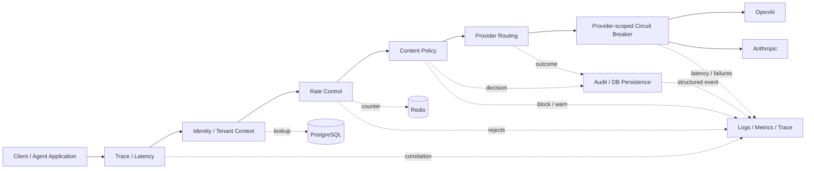

# Policy-Aware Multi-LLM Gateway

LLM / Agent 利用の identity・policy・rate control・content security・provider resilience・audit を、Gateway 境界で共通適用する Spring Boot ベースの運用統治レイヤー。
複数アプリケーションと LLM Provider の間に置く **Policy Enforcement Point** のリファレンス実装であり、AWS への deploy・observe・verify を対象とする個人開発の検証基盤も含みます。

## Problem — 解決する課題

各アプリケーションが Provider API を直接呼ぶと、共通の利用方針を変更・追跡する責務が分散します。

- Provider API Key の保管・更新がアプリケーションごとに必要になる。
- Tenant / API Client の利用許可と停止判断が統一されない。
- Rate Limit が個別実装となり、Tenant 単位の利用量を制御しにくい。
- PII / Prompt Injection の検知・処置がアプリケーションごとに異なる。
- Provider 障害時の timeout・fallback の挙動がばらつく。
- Audit / Trace / Metrics が分散し、呼び出し結果を追跡しにくい。
- Provider 固有のリクエスト・レスポンス形式がアプリケーションへ漏れる。

## What This System Does

| Capability | Gateway が適用する制御 |
| --- | --- |
| Tenant Authentication | `X-API-Key` の SHA-256 hash で ACTIVE な API Client を検索し、SUSPENDED Tenant を拒否 |
| Tenant-aware Policy | Tenant の毎分リクエスト上限・PII action・Injection action を Request Context に解決 |
| Rate Limiting | Redis の Tenant 単位 Fixed Window。上限超過は 429、Redis 障害時は fail-open |
| Content Security | 全メッセージ本文をルールで評価し、Provider 呼び出し前に MASK / BLOCK 等を適用 |
| Multi-Provider Abstraction | OpenAI 互換の chat endpoint から OpenAI / Anthropic へ形式を変換 |
| Controlled Degradation | Provider 単位 Circuit Breaker と、分類された障害だけを対象とする single-step fallback |
| Audit / Observability | 成功・content block・routing error の監査記録、Trace、latency、利用量、Micrometer metrics |
| AWS Operational Verification | Terraform、ECS、Secrets Manager、CloudWatch、OIDC deploy / smoke / rollback の検証構成 |

## Architecture


```mermaid
flowchart LR
    C[Client / Agent Application] --> T[Trace / Latency]
    T --> I[Identity / Tenant Context]
    I --> R[Rate Control]
    R --> S[Content Policy]
    S --> P[Provider Routing]
    P --> B[Provider-scoped Circuit Breaker]
    B --> O[OpenAI]
    B --> A[Anthropic]
    I -. lookup .-> DB[(PostgreSQL)]
    R -. counter .-> Redis[(Redis)]
    S -. decision .-> Audit[Audit / DB Persistence]
    P -. outcome .-> Audit
    T -. correlation .-> Obs[Logs / Metrics / Trace]
    R -. rejects .-> Obs
    S -. block / warn .-> Obs
    B -. latency / failures .-> Obs
    Audit -. structured event .-> Obs
```

Content Policy を通過したリクエストだけを Provider へ送ります。Fallback は routing 層で判断し、別 Provider の Circuit Breaker を通して一度だけ実行します。
AWS の構成は後述の Operational Verification と既存ドキュメントに分離しています。

## Key Engineering Decisions

| Decision | Why | Trade-off |
| --- | --- | --- |
| Gateway を Policy Enforcement Boundary にする | 各アプリケーションの認証・rate・content policy・audit を共通化する | 共通依存となり、latency と policy 変更の影響が複数アプリケーションに及ぶ |
| Tenant Context で policy を解決する | Tenant ごとの利用上限と content action を適用する | DB 設定の管理と、global default との precedence が必要 |
| Selective Fallback を採用する | 接続・Provider 障害時に代替経路を試し、4xx や変換エラーを隠蔽しすぎない | failure 分類と fallback 先の model / message 条件を管理する必要がある |
| 障害の責務ごとに failure policy を分ける | Redis / audit 保存の障害では処理を継続し、content BLOCK では送信を止める | Rate Limit の一時的な不適用や監査欠損を許容する。認証 DB 障害まで fail-open にはしない |
| OpenAI-compatible boundary と Provider mapper を使う | Client と Provider 固有の API 形式の結合を弱める | 共通 DTO の範囲に制約があり、Provider 固有機能をすべて表現できない |

## Governance / Request Lifecycle

`POST /v1/chat/completions` の主な判定順序は次のとおりです。

1. **Trace / Latency** — `X-Request-Id` があれば採用し、なければ UUID を生成。MDC と response header に Trace ID を設定し、filter chain 全体の時間を計測します。
2. **Authentication / Tenant Context** — API Key hash から ACTIVE Client と Tenant を取得。無効な key は 401、SUSPENDED Tenant は 403。Tenant / Client ID、rate limit、content action を後段へ渡し、終了時に Context を消去します。
3. **Rate Control** — Tenant ID と UTC の暦分を Redis key にして `INCR`。上限超過は 429 で止め、残数ヘッダを返します。Redis 障害時は制御を通過させ、rate ヘッダを省略します。
4. **Content Security** — リクエスト DTO の検証後、PII と Injection を元の本文で検知。両方が BLOCK 条件を満たす場合は PII を優先します。MASK は新しい本文へ適用し、BLOCK は Provider 選択・呼び出し前に拒否します。
5. **Provider Selection** — `X-Gateway-Requested-Provider` または既定の `openai` を解決。Provider registry と model / message 条件を確認し、不一致は 400 で拒否します。
6. **Invocation / Circuit Breaker** — Provider ごとの mapper と HTTP client で呼び出します。接続 timeout は 5 秒、read timeout は既定 30 秒。Circuit Breaker は Provider ごとに独立します。
7. **Selective Fallback** — 対象 failure ならもう一方の Provider を一度だけ試行。互換性のない model は fallback 先の既定値に切り替え、必要な message 条件を満たさなければ fallback を行いません。
8. **Audit / Observability** — Controller が成功・content block・routing error の event を記録。Provider / fallback / security の metrics と Trace により、実際の経路と判定を追跡します。

Tenant override は **毎分リクエスト上限・PII action・Injection action** です。Content action は有効な Tenant 設定を優先し、未設定・空・無効な値では global default（PII `MASK`、Injection `BLOCK`）へ戻ります。
Provider / model の Tenant 別許可リストや、Tenant 別 timeout / fallback 設定はありません。

### Audit に残る情報

- Trace / Tenant / Client ID、requested / resolved Provider、model、fallback 使用有無・理由。
- HTTP status、処理結果、Controller 内の latency、error message、Provider が返した token usage。
- PII の検知・action・pattern、Injection の検知・action・rule ID・score・category。
- メッセージ本文の連結から計算した SHA-256 hash と、検知済み PII をマスクした最大200文字（suffix込み）の preview。

現実装の DB 保存は **同期・fail-open** です。保存例外は metric とログへ記録し、main request を失敗させませんが、DB 待機時間はレスポンス時間へ加わります。
認証拒否・Rate Limit 拒否・DTO validation error は Audit DB 保存の対象外で、rate 判定結果も audit event / DB へ連携されていません。
JSON logging は `local` 以外で有効です。ローカルは Prometheus / Grafana、AWS は CloudWatch Logs / Dashboard を使います。

## Policy & Reliability Behavior

### Content Policy

PII は email・電話番号・credit card 形式・一部 API Key 形式を正規表現で検知します。
Injection は NFKC・小文字化・format character 除去・空白正規化後にルールを照合し、rule ごとに一度だけ加点します。
合計 score が 70 以上、または system prompt 抽出 / secret 窃取の指定ルール一致で検知とし、category と score を記録します。Score は攻撃確率を表すものではありません。

| Situation | Behavior |
| --- | --- |
| PII + `MASK` | 一致文字列を `[EMAIL_REDACTED]` 等へ置換した本文を Provider へ送る |
| PII + `BLOCK` | 400。Provider を呼ばず、block 判定を audit event に記録 |
| PII + `ALLOW` | 検知結果を記録し、本文は変更せず送る |
| Injection + `BLOCK` | 403。Provider を呼ばず、rule / score / category を audit event に記録 |
| Injection + `WARN` | 本文を通過させ、検知結果を audit event と warn metric に記録 |
| Injection + `ALLOW` | 検知結果を記録し、本文を通過させる |

PII は `ALLOW / MASK / BLOCK`、Injection は `ALLOW / WARN / BLOCK` をサポートします。
Preview は PII action に関係なく検知済み PII をマスクしますが、未検知の機密情報まで除去する保証はありません。

### Provider Failure

| Failure classification | Fallback? | Failure に対応する HTTP status |
| --- | --- | --- |
| `TIMEOUT` | 対象 | 503 |
| `CONNECTION_ERROR` | 対象 | 503 |
| `UPSTREAM_5XX` | 対象 | 502 |
| `BREAKER_OPEN` | 対象。元 Provider の HTTP 呼び出しを省略 | 503 |
| `UPSTREAM_4XX`（429 を含む） | 対象外。Circuit Breaker の失敗集計からも除外 | 502 |
| `INVALID_RESPONSE` | 対象外。Circuit Breaker の失敗集計には含める | 502 |

上表の status は primary failure の対応値です。Fallback を試して失敗した場合は **最後の failure** に対応する status を返します。
経路は `openai → anthropic` または `anthropic → openai` の一段のみです。Fallback 先の失敗から再帰的に戻ることはありません。
Model の互換性検証は `claude-` prefix による分類であり、実在する model や利用権限の検証ではありません。

## Validation / Evidence

以下はリポジトリ内のテストで確認している境界です。Provider は mock / MockWebServer を使い、外部 LLM の稼働や商用運用実績を示すものではありません。
テスト入口は `./gradlew test`。CI はテストと `bootJar` build を実行します。

| Evidence | Representative tests |
| --- | --- |
| 認証 filter の 401 / suspended 403 と Context cleanup（認証 service は mock） | [ApiKeyFilterTest](src/test/java/io/github/mlprototype/gateway/filter/ApiKeyFilterTest.java) |
| 429 / headers / Redis 障害時の通過と header 省略 | [RateLimitFilterTest](src/test/java/io/github/mlprototype/gateway/ratelimit/RateLimitFilterTest.java)、[RedisUnavailabilityIntegrationTest](src/test/java/io/github/mlprototype/gateway/ratelimit/RedisUnavailabilityIntegrationTest.java) |
| PII MASK / BLOCK、同時検知時の優先順位 | [ContentSecurityServiceTest](src/test/java/io/github/mlprototype/gateway/content/ContentSecurityServiceTest.java) |
| Injection 正規化・score・category・rule の重複加点防止 | [InjectionDetectorTest](src/test/java/io/github/mlprototype/gateway/content/InjectionDetectorTest.java) |
| Content block の HTTP semantics、Provider 未呼び出し、audit event | [ContentSecurityIntegrationTest](src/test/java/io/github/mlprototype/gateway/api/ContentSecurityIntegrationTest.java) |
| Mapper の token 上限、timeout fallback、Provider / model 条件 | [OpenAiRequestMapperTest](src/test/java/io/github/mlprototype/gateway/provider/openai/OpenAiRequestMapperTest.java)、[ProviderRoutingServiceTest](src/test/java/io/github/mlprototype/gateway/router/ProviderRoutingServiceTest.java) |
| 実 HTTP client 経由の 5xx fallback / 4xx 非fallback / breaker open / Anthropic mapping | [ProviderRoutingIntegrationTest](src/test/java/io/github/mlprototype/gateway/api/ProviderRoutingIntegrationTest.java) |
| Audit の Injection field mapping、Prometheus 公開、Controller response headers | [AuditLoggerTest](src/test/java/io/github/mlprototype/gateway/audit/AuditLoggerTest.java)、[GatewayMetricsIntegrationTest](src/test/java/io/github/mlprototype/gateway/observability/GatewayMetricsIntegrationTest.java)、[ChatCompletionControllerTest](src/test/java/io/github/mlprototype/gateway/api/ChatCompletionControllerTest.java) |

AWS profile / Redisなしのhealth、DB provisioning後のHTTP認証、長文previewの実PostgreSQL保存は [AWS Health test](src/test/java/io/github/mlprototype/gateway/api/AwsHealthIntegrationTest.java) / [Persistence test](src/test/java/io/github/mlprototype/gateway/security/OperationalPersistenceIntegrationTest.java) で検証します。

## Operational Verification on AWS

AWS は、この Gateway の配備・secret 注入・観測・復旧を検証対象にした構成です。常時稼働する商用サービスの運用実績は主張しません。

- **Infrastructure** — [Terraform](infra/aws/) で ECS Fargate / ECR / IAM / Secrets Manager / CloudWatch と optional RDS / Redis / ALB を管理。
- **Secrets** — API Key の実値は Terraform 外で登録し、ECS 起動時に注入。Gateway key は明示的な `aws-bootstrap` process でhashをDBへ登録し、通常起動では登録・更新しない（[手順](docs/infra/OPERATIONS_RUNBOOK.md#authentication-provisioning)）。RDS password は RDS 管理シークレットを参照し、rotation 後の再deploy を EventBridge / SSM Automation に定義。
- **State** — S3 remote backend と `use_lockfile = true` を使用。State bucket の versioning・暗号化・public access block、および CI OIDC Role は別途 bootstrap する運用。
- **CI/CD** — [deploy workflow](.github/workflows/deploy.yml) に test → OIDC / Terraform validate・plan → Git SHA tag の ECR push → ECS 更新 → ECS Exec health smoke を定義。Terraform apply は含まず、起動可能な RDS 接続済み Task Definition が前提。
- **Rollback** — deploy step を実行した後の失敗で、記録した直前の Task Definition / desired count への復元を要求し、service stability を期限付きで確認。Deploy step 自体の失敗も復元対象とし、成功時の起動数復元後も安定化を待つ。
- **Zero-Idle** — 既定は `desired_count = 0`、RDS / Redis / ALB 無効。検証後の選別削除は運用手順で実施し、ECR / Secrets / IAM / state を保持するため費用ゼロを保証するものではありません。

CloudWatch はアプリログと ECS の CPU / memory 等を観測する構成です。アプリの Prometheus metrics を CloudWatch へ転送する設定は含みません。
詳細は [AWS Architecture](docs/infra/AWS_ARCHITECTURE.md)、[CI/CD Pipeline](docs/infra/CI_CD_PIPELINE.md)、[Operations Runbook](docs/infra/OPERATIONS_RUNBOOK.md) を参照してください。

## Tech Stack

| Layer | Technology |
| --- | --- |
| Application | Java 21、Spring Boot 3.5.14、Spring MVC / Virtual Threads、Gradle |
| Identity / Persistence | Spring Data JPA、PostgreSQL、Flyway |
| Rate / Resilience | Redis、Resilience4j |
| Observability | Micrometer、Prometheus / Grafana、Logstash JSON logging、CloudWatch |
| API / Container | springdoc-openapi / Swagger UI、Docker / Docker Compose |
| AWS / Delivery | ECS Fargate、ECR、RDS、Secrets Manager、Terraform、S3 state / locking、GitHub Actions / OIDC |

## Quick Start — Local

Docker / Docker Compose と、利用する Provider の API Key を準備します。Gradle をホストで実行する場合は Java 21 が必要です。

### 1. Environment

```bash
git clone https://github.com/mlprototype/policy-aware-llm-gateway.git
cd policy-aware-llm-gateway
cp .env.example .env
```

`.env` の `GATEWAY_API_KEY` を `dev-gateway-key-001` にし、`OPENAI_API_KEY` と、fallback を使う場合は `ANTHROPIC_API_KEY` を設定します。
認証は DB lookup です。`GATEWAY_API_KEY` を変更するだけでは key は登録されません。Compose の `local` profile は [dev seed](src/main/resources/db/seed/V2_1__seed_dev_tenant.sql) を投入します。

### 2. Start / Health

```bash
docker compose up --build -d
# 起動完了後に確認
curl -fsS http://localhost:8080/actuator/health
```

### 3. One Chat Request

```bash
curl -i http://localhost:8080/v1/chat/completions \
  -H 'Content-Type: application/json' \
  -H 'X-API-Key: dev-gateway-key-001' \
  -d '{"messages":[{"role":"user","content":"日本語で一言あいさつしてください"}],"max_tokens":32}'
```

この呼び出しは実 Provider を利用します。Response の Trace ID・resolved Provider・fallback 使用有無で処理経路を確認できます。
Local の [Swagger UI](http://localhost:8080/swagger-ui.html) / [OpenAPI](http://localhost:8080/v3/api-docs) に API 詳細、[Grafana](http://localhost:3000) に dashboard があります。
設定の現行値は [application.yml](src/main/resources/application.yml) と [profile 設定](src/main/resources/) を参照してください。Compose は `.env` の content action を app へ渡し、省略時は PII `MASK` / Injection `BLOCK` を適用します。

## Known Limitations

| Area | 現在の制約 |
| --- | --- |
| Content Detection | ルールベースのため False Positive / False Negative がある。レスポンス側 redaction は未実装で、preview にも未検知の機密情報が残り得る |
| Audit Delivery | 同期・fail-open。非同期保存や Strong Delivery Guarantee はない。認証・rate 拒否等を網羅しない |
| Authentication | 無塩 SHA-256 による決定論的 lookup を優先。高エントロピー key と更新運用が必要。AWS は明示的な Tenant / Client provisioning が必要で、key rotation / revoke は自動化しない |
| Rate Control | UTC 暦分の Fixed Window で境界 burst を許容。Redis 障害時は制限しない。`Retry-After` は残り時間ではなく固定 60 秒 |
| API / Routing | 共通 DTO の chat のみで stream / tools 等は未実装。Model 検証は prefix 分類、fallback は一段で出力・cost・latency が変わり得る |
| AWS Topology | 個人検証用の Public Subnet / public IP 構成。RDS も public accessibility が有効（DB ingress は ECS SG に限定）。Private Subnet / TLS 公開経路 / WAF は未実装 |
| AWS Optional Services | Redis / ALB は optional・既定無効。RDS も既定無効だが起動には必要。AWS health は fail-open のRedisを必須条件から除外し、Redis稼働を証明しない |
| CI/CD Verification | Smoke は明示的shell・HTTP成功後のmarkerを確認するhealth検証で、認証済みchatは別の明示的手順。実AWSのExec / 復元成功は別途検証が必要 |
| Availability / Operations | Auto Scaling、Multi-AZ RDS、SLA / DR、Blue-Green は未対応。商用 Production で継続運用された実績を示すものではない |
| Providers | OpenAI / Anthropic のみ。Bedrock / Azure Provider は未実装 |

## Related Projects / Further Documentation

| Project | 担う層 |
| --- | --- |
| [spec-rag-qa](https://github.com/mlprototype/spec-rag-qa) | 品質保証 / Evaluation |
| [ai-agent-rag](https://github.com/mlprototype/ai-agent-rag) | 動的制御 / Orchestration / Control Plane |
| **policy-aware-llm-gateway** | **運用統治 / Governance / Reliability** |

- [AWS Architecture](docs/infra/AWS_ARCHITECTURE.md) / [CI/CD Pipeline](docs/infra/CI_CD_PIPELINE.md)
- [Security Model](docs/infra/SECURITY_MODEL.md) / [Operations Runbook](docs/infra/OPERATIONS_RUNBOOK.md)
- [Cost Strategy](docs/infra/COST_OPTIMIZATION.md) / [Terraform Deployment Guide](infra/aws/TERRAFORM_DEPLOYMENT_GUIDE.md)
- [Configuration Source](src/main/resources/application.yml) / [Architecture Decision Records](docs/adr/)

運用 docs は設計意図・手順の参照先です。現行挙動の確認には source / tests / Terraform / workflows を併せて参照してください。
