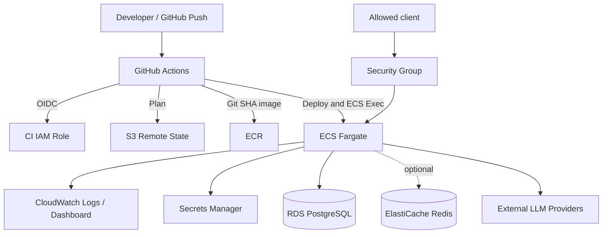

# AWS Architecture

## Overview

Spring Boot 製 `Policy-Aware Multi-LLM Gateway` を AWS 上で検証する構成である。ECS Fargate、ECR、RDS、Secrets Manager、CloudWatch、GitHub Actions、Terraform を使う。個人検証構成である。

## Architecture Goals

- AWS 上でデプロイ、ログ確認、動作検証を行う
- Terraform で構成を再現する
- API Key と DB 認証情報を Git と state から分離する
- CI/CD で test、smoke test、rollback を確認する
- 低コストと将来の拡張余地を両立する

## High-Level Architecture

## AWS Components

| Component | Purpose | Notes |
| --- | --- | --- |
| ECS Fargate | Gateway 実行 | `desired_count` で制御。 |
| ECR | イメージ格納 | Git SHA タグを push。 |
| RDS PostgreSQL | Gateway DB | `enable_rds=true` 時のみ。 |
| Redis | レート制御バックエンド | `enable_redis=true` 時のみ。 |
| ALB | 任意の公開入口 | `enable_alb=true` 時のみ。 |
| Secrets Manager | API Key・DB 認証情報 | 実値を state に保存しない。 |
| CloudWatch | ログ・可視化 | ECS とアプリを確認。 |
| S3 | Terraform state | 暗号化、versioning、lock。 |
| IAM / SG | 権限・通信制御 | OIDC と許可 CIDR。 |

## Deployment Modes

**Default / idle mode** は `desired_count = 0`、RDS・Redis・ALB 無効で基盤だけを保持する。**Verification mode** は `desired_count = 1` と `enable_rds = true` を指定する。AWS プロファイルでは PostgreSQL 接続が起動に必須であるためである。ALB と Redis は必要な検証に限り有効化する。

## Network Design

NAT Gateway の固定費を避け、既存 VPC の Public Subnet に public IP 付き ECS タスクを配置する。直接 HTTP の接続元は `allowed_ingress_cidr` で制限し、CI は ECS Exec でタスク内部から確認する。本番適用時は Private Subnet、ALB、WAF、NAT Gateway または VPC Endpoint を検討する。

## Runtime Flow

ECS は ECR から image を取得し、Task Execution Role でログ出力とシークレット注入を行う。Gateway は RDS に接続し、必要に応じて Redis を使い、外部 LLM Provider を呼び出す。ログと稼働状況は CloudWatch で確認する。

## State and Secrets Management

Terraform state は S3 remote backend に保存し、`use_lockfile = true` を有効化する。API Key は Secrets Manager へ直接登録し、`aws_secretsmanager_secret_version` では管理しない。CI Role は `GetSecretValue` を持たず、必要 ARN だけを Task Execution Role に許可する。

## Observability

CloudWatch Logs、task status、Dashboard、GitHub Actions ログを利用する。Alarm とメトリクスの拡張は今後の改善事項である。

## Cost-Aware Design

Zero-Idle 方針により通常は Fargate を停止する。RDS、Redis、ALB はトグルで作成し、検証後に無効化する。ECR の世代数と CloudWatch Logs の保持日数も制限する。

## Production Considerations

本番適用時は、Private Subnet、ALB、WAF、Auto Scaling、Multi-AZ RDS、バックアップ、Alarm、シークレットローテーション、さらに細かい IAM 権限を設計する。これらは現行構成には含まれない。

## Related ADRs

- [ADR-001: ECS Fargate](../adr/001-use-ecs-fargate.md)
- [ADR-002: S3 Remote State](../adr/002-use-s3-remote-state.md)
- [ADR-004: Secrets Manager](../adr/004-secrets-manager-without-secret-version.md)
- [ADR-005: Zero-Idle Strategy](../adr/005-zero-idle-cost-strategy.md)
- [ADR-006: ECS Exec Smoke Test](../adr/006-ecs-exec-smoke-test.md)
