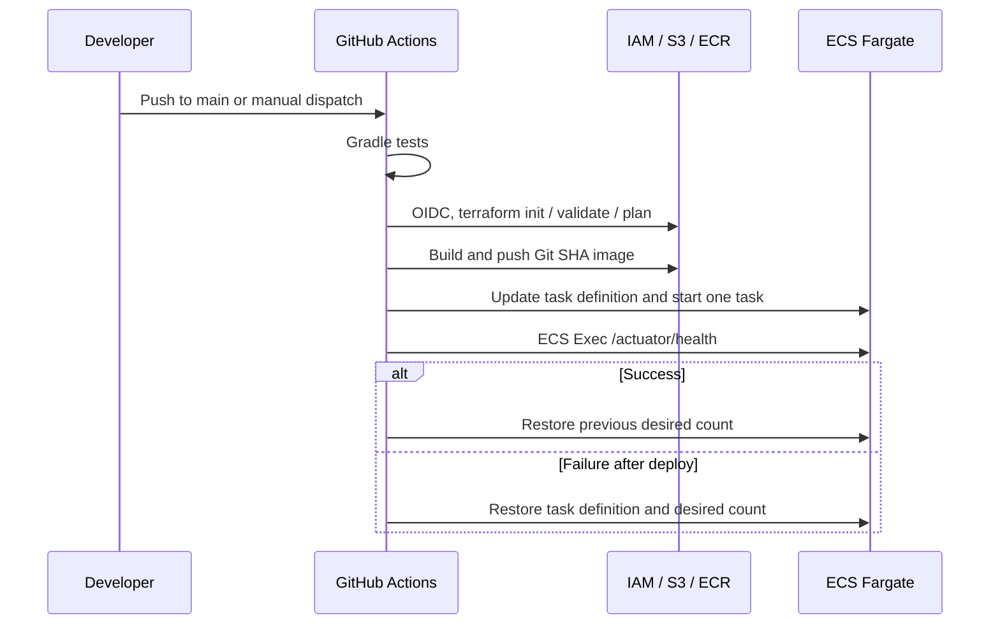

# CI/CD Pipeline

## Overview

GitHub Actions で test、Terraform 検証、image 配布、ECS 一時デプロイ、smoke test、失敗時の復元を行う。現行Workflowのトリガーは対象パスを含む `main` への push と `workflow_dispatch` であり、pull request トリガーは未設定である。

## Pipeline Goals

- test 成功前に ECR push や ECS 更新を行わない
- 静的 AWS キーを使わず OIDC を使う
- remote state と実リソースを基準に plan する
- 外部公開 IP ではなく ECS Exec で health check する
- 失敗時に直前のタスク定義と起動数を復元する

## Trigger Strategy

`src/**`、`infra/aws/**`、Dockerfile、Gradle 設定、Workflow 定義の変更を含む `main` への push で起動する。concurrency group によりデプロイを直列化し、ロールバック対象を取り違えない。手動実行は再検証に使う。

## Pipeline Flow

## CI Steps

最初の job は PostgreSQL と Redis のサービスコンテナを使い、`./gradlew test` を実行する。成功後、Terraform job が `terraform fmt -check -recursive`、`terraform validate`、`terraform plan` を実行する。Docker build と ECR push は両 job の成功後に行う。Lint、脆弱性スキャン、IaC スキャンは今後の追加候補である。

## Deployment Steps

deploy job は現在の Task Definition ARN と `desired_count` を記録する。Gradle で JAR を作成し、Buildx で build した image を Git SHA タグで ECR へ push する。アクティブなタスク定義の `gateway` image を差し替えて Service へ反映する。タスク定義更新時は、idle 状態での不要な Runner 占有を避けるためサービス安定化を待たない。

## Terraform Plan with Remote State

OIDC 認証後に通常の `terraform init` を実行して S3 remote state を使う。plan は AWS 実リソースを refresh して差分を確認するため、`-backend=false`、`-lock=false`、`-refresh=false` は使用しない。

## Smoke Test Strategy

Workflow は一時的に `desired_count = 1` として安定化を待ち、ECS Exec でコンテナ内部の `http://127.0.0.1:8080/actuator/health` を確認する。準備待ちのためリトライし、public IP や ALB に依存しない。

## Rollback Strategy

デプロイ後に smoke test、ECS Exec、起動数の復元が失敗した場合、記録済みの Task Definition と `desired_count` を `--force-new-deployment` で復元する。失敗時は直近の CloudWatch Logs も出力する。

## IAM and OIDC

`AWS_ROLE_ARN` を使い、`aws-actions/configure-aws-credentials` で OIDC Role を引き受ける。Role には ECR、ECS、state 用 S3、限定した `iam:PassRole` を付与し、長期アクセスキーは保存しない。

## Security Considerations

CI Role は `secretsmanager:GetSecretValue` を持たず、Secret 値を job やログへ渡さない。state と lockfile、ECS Exec の権限は必要最小限にし、Security Group を CI Runner のために広く開放しない。

## Limitations and Future Improvements

環境分離、承認ゲート、pull request 検証、Trivy・Checkov・Dependabot、通知連携は未実装である。本番適用時は環境別 Role、保護ブランチ、承認・監査フローを検討する。

## Related ADRs

- [ADR-002: S3 Remote State](../adr/002-use-s3-remote-state.md)
- [ADR-003: GitHub Actions OIDC](../adr/003-use-github-actions-oidc.md)
- [ADR-006: ECS Exec Smoke Test](../adr/006-ecs-exec-smoke-test.md)
